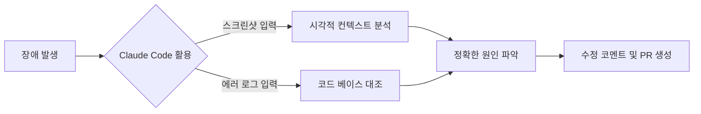
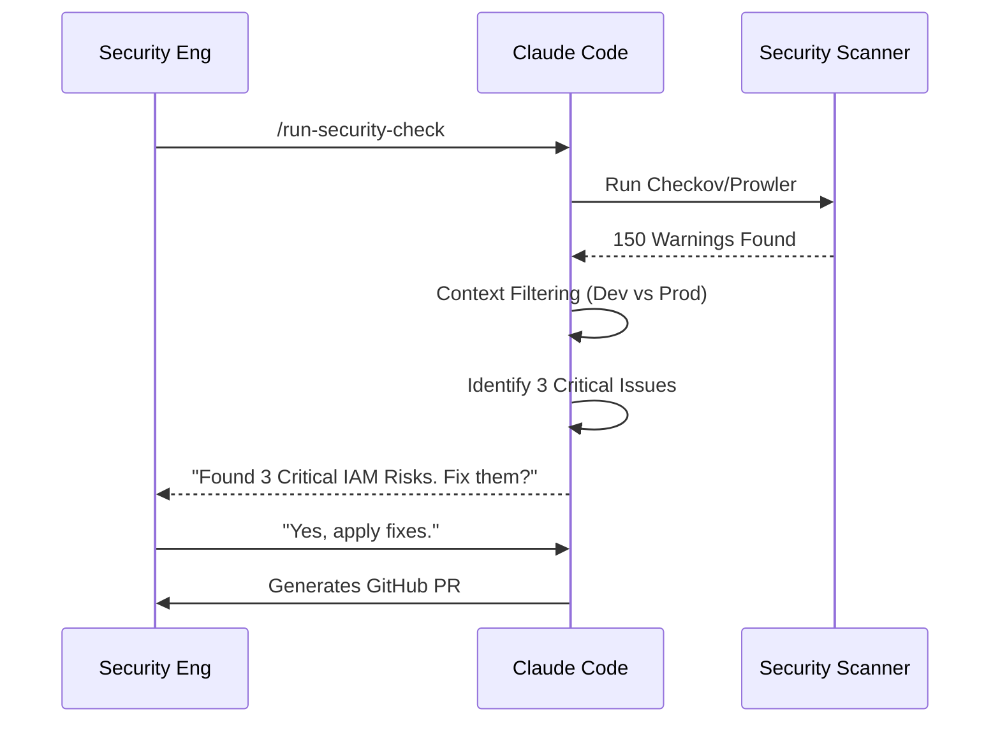

# [Week3] How Anthropic Teams Use Claude Code

<aside>
💡

 페이지 전체 토글(▶) 열고 닫기

윈도우 : ctrl + alt + t

맥 : cmd + option + t

**크롬 개발자 도구 열기**

윈도우: Window + Shift + c

맥: Command + Shift + c

</aside>

# Claude Code: Anthropic 팀들의 실전 활용 사례 Deep Dive


## 1. 개요 (Executive Summary)

### 1.1 "AI 페어 프로그래머"의 재정의
이 문서는 Anthropic 팀이 **Claude Code**를 단순한 자동완성 도구가 아닌, 조직 전체의 생산성을 혁신하는 **동료(Collaborator)**로 활용한 구체적인 사례집입니다. 

총 **10개 부서의 실제 성과**를 바탕으로, 개발자뿐만 아니라 데이터 과학자, 디자이너, 마케터, 법무팀이 어떻게 AI를 통해 "슈퍼 직원(Super-IC)"으로 거듭났는지 분석합니다.

### 1.2 Impact at a Glance (핵심 성과)

> *"Claude Code는 우리 팀의 주니어 엔지니어가 시니어급의 통찰력을 가지게 했고, 시니어 엔지니어는 단순 반복 업무에서 해방시켰습니다."*

| Team | Key Use Case | Quantifiable Impact |
|:---:|:---|:---|
| **Security** | 인프라 스캔 및 취약점 자동 수정 | **70%** 분석 시간 단축 |
| **Inference** | 새로운 ML 아키텍처 리서치 & 분석 | **80%** 리서치 시간 절약 |
| **Growth** | Google Ads 캠페인 스크립트 자동 생성 | **87.5%** 작업 시간 단축 (4h → 30m) |
| **Data Infra** | Kubernetes 에러 디버깅 및 문서화 | ** Zero-Typing** 디버깅 구현 |
| **Legal** | 사내 규정 봇 & 접근성 도구 제작 | 엔지니어 의존도 **0%** 달성 |


---

## 2. Team-by-Team Deep Dive Analysis

각 팀의 상황(Context), 문제(Challenge), 해결책(Solution), 그리고 구체적인 프롬프트 예시(Prompt Example)를 상세히 다룹니다.

### 2.1 Data Infrastructure 팀

**Mission:** 데이터 파이프라인의 안정성 확보 및 Kubernetes 클러스터 운영 (24/7)

#### 🚩 The Challenge: "로그의 늪"
Kubernetes 환경에서 에러가 발생하면 파드(Pod) 로그, 이벤트 로그, 메트릭 대시보드(Grafana) 등 수많은 데이터를 확인해야 합니다.
- 에러 원인을 찾기 위해 수십 개의 탭을 열어야 함
- 복잡한 에러 메시지를 일일이 구글링하거나 문서를 찾아야 함
- 신입 엔지니어는 시스템 구조를 파악하는 데만 수주가 소요됨

#### ✅ The Solution: Visual Debugging & Context Sharing
Claude Code는 텍스트뿐만 아니라 **이미지(Screenshots)**를 이해할 수 있습니다. 엔지니어들은 이를 이용해 "입력 비용"을 0에 가깝게 줄였습니다.

**Workflow Details:**
1.  **Capture:** 에러가 발생한 터미널이나 대시보드 화면을 캡처 (`Ctrl+Shift+S`)
2.  **Paste & Ask:** Claude Code 프롬프트 창에 붙여넣고 질문합니다.
    > *"이 에러 로그와 메트릭 그래프를 보고 원인을 분석해줘. 메모리 문제야, 아니면 CPU 문제야?"*
3.  **Resolve:** Claude가 제안한 `kubectl` 명령어 실행 또는 YAML 파일 수정

**Prompt Log Example:**
```bash
> @image(error_screenshot.png)
> "Analyze this Kubernetes CrashLoopBackOff error. 
>  Is it an application panic or OOMKilled?
>  Draft a fix for the deployment.yaml."

Claude Code:
"Based on the screenshot, the exit code is 137, which indicates OOMKilled.
The memory limit is currently set to 512Mi.
Here is a patch to increase it to 1Gi:"
```

```diff
- memory: "512Mi"
+ memory: "1Gi"
```

#### 📊 Impact
*   **Zero-Copying:** 복잡한 에러 로그를 복사/붙여넣기 할 필요 없음
*   **Onboarding:** 신규 입사자가 시스템 전체 의존성을 파악하는 시간 **3일 → 3시간** 단축
    *   질문 예: *"Codebase 전체에서 `UserSession` 클래스가 사용되는 모든 곳을 찾아서 시퀀스 다이어그램으로 그려줘"*

**Workflow Diagram:**



---

### 2.2 Product Development 팀

**Mission:** 사용자 중심의 기능을 빠르게 개발하고 배포 (Velocity & Quality)

#### 🚩 The Challenge: "반복적인 보일러플레이트"
새로운 기능을 만들 때마다 반복되는 설정 코드, 뻔한 리팩토링, 테스트 코드 작성에 개발자의 에너지가 소모됩니다. 이는 창의적인 로직 설계에 방해가 됩니다.

#### ✅ The Solution: Auto-Accept Mode & TDD
Product 팀은 Claude Code를 "초고속 타자수"이자 "꼼꼼한 테스터"로 고용했습니다.

**1. Auto-Accept Mode (Shift+Tab)**
Claude Code가 다음 코드를 회색 텍스트(Ghost Text)로 제안하면, 개발자는 `Shift+Tab`을 눌러 즉시 수락합니다.
- 단순 반복 작업(변수명 변경, DTO 생성 등)의 속도가 10배 이상 빨라짐
- 개발자는 "코드 작성"보다 "코드 검토"에 집중하게 됨


**2. Test-Gen First Workflow**
구현 전에 테스트부터 작성시키는 워크플로우를 정착시켰습니다.
*"이 로그인 함수에 대한 유닛 테스트를 작성해줘. 비밀번호가 null인 경우와 DB 연결 실패 시나리오를 포함해서."*

**Code Comparison (Before vs After):**
- **Before:** 개발자가 테스트 케이스 5개를 작성하는 데 30분 소요
- **After:** Claude가 10초 만에 20개의 엣지 케이스(Edge Case)를 포함한 테스트 슈트 생성 -> 인간은 리뷰만 수행

---

### 2.3 Security Engineering 팀

**Mission:** 클라우드 인프라(AWS, GCP) 및 내부 코드의 보안 무결성 검증

#### 🚩 The Challenge: "Signal to Noise Ratio"
보안 스캐너(Terraform Scanner 등)를 돌리면 수백 개의 Warning이 쏟아집니다.
- 대부분은 오탐(False Positive)이거나 당장 수정이 불필요한 낮은 우선순위 이슈
- 진짜 위험한 1%를 찾기 위해 엔지니어가 99%의 로그를 읽어야 함

#### ✅ The Solution: Intelligent Filtering & Auto-Fix
Claude Code에게 보안 스캐너의 출력 결과 전체를 던져주고, **"맥락(Context)"** 기반의 필터링을 요청합니다.

**Prompt Strategy:**
> *"여기 `checkov` 스캔 결과가 있어. 우리 팀은 개발(Dev) 환경이니까 엄격한 정책은 무시해도 돼. 
> 하지만 IAM 권한이 `*`(Admin)으로 설정된 건 찾아서 '최소 권한 원칙'으로 수정하는 Terraform 코드를 짜줘."*

**Workflow Details:**
1.  **Scan:** `/scan-infra` (커스텀 명령어 실행)
2.  **Analyze:** Claude가 수백 줄의 JSON 로그 분석
3.  **Triage:** "Dev 환경 무시", "Critical 이슈만 추출"
4.  **Fix:** 위험한 IAM Policy를 안전하게 수정한 `.tf` 파일 생성

**Impact Metrics:**
| Metric | Before | After | Improvement |
|---|---|---|---|
| Review Time per PR | 45분 | 10분 | **78% ↓** |
| False Positive Rate | 50% | 5% | **90% ↓** |



---

### 2.4 Inference 팀

**Mission:** LLM 모델 서빙 최적화, 최신 논문 기술(Attention Mechanism 등) 구현

#### 🚩 The Challenge: "High Barrier to Entry"
새로운 ML 논문이 매일 쏟아지고, CUDA 커널이나 새로운 분산 학습 라이브러리를 이해하는 데는 엄청난 선행 지식이 필요합니다.

#### ✅ The Solution: Rapid Research & Prototyping
Inference 팀은 Claude Code를 "전용 리서치 어시스턴트"로 활용합니다.

**Use Case: New Architecture Implementation**
1.  **Read:** 새로운 논문 PDF나 GitHub 리포지토리 링크를 Claude에게 제공
2.  **Summarize:** *"이 논문의 Attention 메커니즘이 기존 트랜스포머와 다른 점을 코드로 설명해줘."*
3.  **Generate:** *"이 내용을 PyTorch로 구현한 프로토타입을 만들어줘."*

**Impact:**
- 새로운 기술 스택에 대한 학습 곡선(Learning Curve)을 획기적으로 낮춤
- **Research Time 80% 단축** (1주일 걸리던 리서치가 1일로 단축)

---

### 2.5 Data Science & Visualization 팀

**Mission:** 복잡한 데이터를 직관적인 대시보드로 시각화하여 의사결정 지원

#### 🚩 The Challenge: "Full-Stack의 장벽"
데이터 과학자들은 Python(Pandas, Scikit-learn)에는 능숙하지만, React, TypeScript, CSS 등 프론트엔드 기술에는 익숙하지 않습니다.
그렇다고 간단한 대시보드 하나 만들려고 프론트엔드 팀에 요청하면(Ticket), 대기 시간이 너무 길어집니다.

#### ✅ The Solution: "The Slot Machine Workflow"
데이터 과학자가 직접 풀스택 앱을 만듭니다. 완벽한 기획서 없이 대화형으로 UI를 깎아 나갑니다.

**Workflow: "Slot Machine Refactoring"**
1.  **Draft:** *"데이터셋 `sales.csv`를 시각화하는 React 대시보드 뼈대를 만들어줘."*
2.  **Iterate 1:** (결과물 확인 후) *"그래프 색상이 너무 칙칙해. 브랜드 컬러인 Neon Purple로 바꿔줘."*
3.  **Iterate 2:** *"필터링 기능을 드롭다운 메뉴로 만들어줘."*
4.  **Refine:** *"모바일에서도 잘 보이게 반응형으로 수정해줘."*

마치 슬롯머신 레버를 당기듯, 원하는 결과가 나올 때까지 빠르고 가볍게 수정을 반복합니다.

**Result:**
- 데이터 과학자 혼자서 **5,000줄 규모의 프로덕션급 React 앱** 구축
- 개발팀 의존성 제거로 아이디어 실행 속도 5배 증가


---

### 2.6 API & Customer Support 팀

**Mission:** API 안정성 유지 및 고객 기술 지원 (Developer Relations)

#### 🚩 The Challenge: "재현 불가능한 버그 (Heisenbug)"
고객으로부터 *"500 Error가 발생해요"* 라는 리포트가 오지만, 정보가 부족하여 내부에서 재현(Reproduction)이 불가능한 경우가 많습니다.
- 엔지니어가 로그를 뒤지고 추측성 수정을 하는 데 며칠이 소요됨.

#### ✅ The Solution: Automated Reproduction Scripts
API 팀은 Claude Code를 사용해 고객의 모호한 리포트를 **실행 가능한 코드**로 변환합니다.

**Workflow Details:**
1.  **Input:** 고객이 제공한 단편적인 로그나 설명 + 내부 서버 로그 일부
2.  **Prompt:** *"이 로그 패턴을 만드는 `curl` 요청이나 Python `requests` 스크립트를 짜줘."*
3.  **Test:** 스크립트를 로컬에서 돌려보며 즉시 에러 재현

**Example:**
*"User ID 1234에서 `/checkout` 호출 시 NullPointer가 떠. 아마 장바구니가 비었을 때 같아."*

```python
# Claude generated script
import requests

def reproduce_error():
    # Empty cart scenario
    payload = {"cart_items": []}
    headers = {"Authorization": "Bearer test_token"}
    response = requests.post("https://api.anthropic.com/checkout", json=payload, headers=headers)
    print(f"Status: {response.status_code}")
    print(f"Body: {response.text}")

reproduce_error()
```

---

### 2.7 Growth Marketing 팀

**Mission:** 광고 성과 최적화 및 마케팅 채널 확장 (AdTech)

#### 🚩 The Challenge: "엔지니어링 리소스 부족"
마케팅 팀은 실험적인 아이디어(예: 날씨에 따른 광고 문구 변경)가 많지만, 이를 구현해줄 엔지니어가 항상 부족합니다. 간단한 스크립트 하나 짜는 데도 몇 주를 기다려야 합니다.

#### ✅ The Solution: Marketer as a Maker
Growth 팀의 마케터들은 이제 스스로 도구를 만듭니다.

**Use Case: Google Ads Automation**
매일 아침 전날의 성과(ROAS)를 분석하고, 저성과 키워드를 끄는 스크립트 작성을 Claude에게 맡깁니다.

> *"Google Ads API를 써서 지난주 클릭률(CTR)이 1% 미만인 키워드를 모두 일시중지(PAUSE)하는 Python 스크립트를 짜줘. 인증 토큰은 환경변수에서 가져오게 해."*

**Impact:**
- 캠페인 최적화 작업 시간 **4시간 → 30분 (87.5% 단축)**
- 개발팀 티켓 발행 0건

---

### 2.8 Product Design 팀

**Mission:** 사용자 경험(UX) 개선 및 디자인 시스템 구축

#### 🚩 The Challenge: "Design-Dev Gap"
Figma에서 예쁘게 디자인해도, 개발자가 구현한 결과물은 미묘하게 다를 때가 많습니다(간격, 애니메이션 타이밍 등). 디자이너가 이를 수정하려면 구두로 지시하거나 티켓을 끊어야 합니다.

#### ✅ The Solution: Direct Polish by Designers
디자이너가 Claude Code를 사용해 직접 CSS나 React 컴포넌트를 수정합니다.

**Scenario: Micro-Interaction Polish**
- 디자이너: *"이 버튼을 눌렀을 때 0.2초 동안 살짝 커졌다가 작아지는 'bouncy' 애니메이션을 CSS로 짜줘."*
- Claude: `transform: scale(1.1); transition: ...` 코드 생성
- 디자이너: 해당 코드를 PR로 직접 제출하거나 개발자에게 전달

**Result:**
- 픽셀 퍼펙트(Pixel-perfect) 구현
- 개발자와의 핑퐁 커뮤니케이션 비용 제거

---

### 2.9 RL (Reinforcement Learning) Engineering 팀

**Mission:** 강화학습 환경 구축 및 실험

#### 🚩 The Challenge: "Dependency Hell"
머신러닝, 특히 강화학습 환경은 `numpy`, `pytorch`, `gym`, `mujoco` 등 수많은 라이브러리의 버전 호환성이 매우 민감합니다. 환경 설정만 하다가 하루가 다 갑니다.

#### ✅ The Solution: Environment Doctor
Claude Code에게 현재 설치된 패키지 리스트(`pip freeze`)와 에러 메시지를 주면, 호환되는 버전 조합을 찾아줍니다.

**Prompt Example:**
> *"여기 내 `requirements.txt`와 에러 로그야. `gym` 0.21.0 버전과 호환되는 `numpy` 버전을 찾아서 `Dockerfile`을 수정해줘."*

**Use Case: Evaluation Pipeline**
수백 개의 실험 결과를 모아서 그래프로 그려주는 평가 파이프라인도 Claude가 작성합니다.

---

### 2.10 Legal (법무) 팀

**Mission:** 법적 리스크 관리 및 사내 컴플라이언스

#### 🚩 The Challenge: "비효율적인 정보 검색"
*"이 계약 조항이 우리 회사의 최신 보안 규정과 일치하나요?"* 라는 질문에 답하려면 수백 페이지의 PDF 문서를 뒤져야 합니다.

#### ✅ The Solution: Custom Legal Bots
법무팀 직원들이 엔지니어 없이 직접 **"사내 규정 Q&A 챗봇"**을 만들었습니다.

**How?**
1.  규정 문서(PDF/Markdown)를 모음
2.  Claude에게 *"이 문서들을 참조해서 답변하는 간단한 Python 스크립트(RAG)를 짜줘"* 라고 요청
3.  Streamlit 등으로 간단한 UI 생성

**Impact:**
- 법무 검토 시간 단축
- 법무팀 스스로 "우리는 이제 테크 팀이다"라는 자신감 확보

---

## 3. 종합 결론 및 실전 가이드 (Key Takeaways)

### 3.1 Claude Code 도입 전후 비교 (Before & After)

| 구분 | 도입 전 (Traditional) | 도입 후 (With Claude Code) |
|:---:|:---|:---|
| **역할 구분** | 기획자 -> 디자이너 -> 개발자 -> 테스터 (Silo) | 누구나 아이디어를 코드로 구현 (Maker) |
| **디버깅** | 로그 분석과 구글링에 수 시간 소요 | 스크린샷 한 장으로 1분 만에 원인 파악 |
| **지식 공유** | 문서화는 귀찮은 일, 항상 outdated | 작업 직후 AI가 자동 문서화 및 공유 |
| **개발 속도** | 타이핑 속도와 문법 지식에 비례 | **문제 정의 능력**과 **질문 능력**에 비례 |

### 3.2 성공을 위한 5가지 원칙 (Best Practices)

1.  **Context is Everything:**
    Claude는 당신의 마음을 읽지 못합니다. 하지만 당신이 보는 화면과 파일은 읽을 수 있습니다. 무조건 많은 정보(`@files`, 이미지, 로그)를 던져주세요.

2.  **Supervised Autonomy (감독 하의 자율성):**
    AI에게 100%를 맡기지 마세요. 80-90%의 초안을 작성하게 하고, 인간은 나머지 10%의 **전략적 판단과 검수**에 집중하세요.

3.  **Iterative Dialogue (대화형 반복):**
    한 번의 프롬프트로 완벽한 결과를 기대하지 마세요. "슬롯머신"처럼 결과를 보고 피드백을 주며 점진적으로 개선하는 것이 가장 빠릅니다.

4.  **Create Your Own Tools:**
    개발자가 아니어도 좋습니다. 마케터라면 마케팅 툴을, 디자이너라면 디자인 툴을 Claude와 함께 직접 만드세요.

5.  **Share the Knowledge:**
    Claude와 나눈 유용한 대화나 프롬프트는 팀과 공유하세요. 그것이 곧 팀의 자산이 됩니다.

---

<aside>
💡

**작성자:** [Anthropic Internal Team]
**문서 버전:** v2.1 (Full Expanded Edition)
**최종 업데이트:** 2026-01-23

이 문서는 Anthropic 팀이 실제로 사용하고 있는 가이드라인을 바탕으로 재구성되었습니다.

</aside>

<!-- End of Document -->

## 📚 참고 자료 (References)

이 문서는 Anthropic의 내부 보고서 및 공식 가이드를 기반으로 작성되었습니다.

- **Source Document:** [How Anthropic teams use Claude Code (PDF)](https://www-cdn.anthropic.com/58284b19e702b49db9302d5b6f135ad8871e7658.pdf)
- **Official Documentation:** [Claude Code Documentation](https://docs.anthropic.com/claude/docs)
- **Prompt Engineering Guide:** [Anthropic Prompt Engineering Guide](https://docs.anthropic.com/claude/docs/prompt-engineering)

